# Credit Risk Model

A production-grade credit risk modeling pipeline that predicts 12-month loan default probability for unsecured installment loans. The project compares XGBoost and Logistic Regression approaches, implements compliance-aware feature engineering, isotonic calibration, and includes fairness analysis.

---

## Table of Contents

- [Overview](#overview)
- [Project Structure](#project-structure)
- [Dataset](#dataset)
- [Methodology](#methodology)
  - [1. Exploratory Data Analysis](#1-exploratory-data-analysis)
  - [2. Data Splitting](#2-data-splitting)
  - [3. Preprocessing Pipeline](#3-preprocessing-pipeline)
  - [4. XGBoost Model](#4-xgboost-model)
  - [5. Logistic Regression Baseline](#5-logistic-regression-baseline)
  - [6. Model Comparison](#6-model-comparison)
- [Results](#results)
- [Key Design Decisions](#key-design-decisions)
- [Getting Started](#getting-started)

---

## Overview

This project builds and evaluates two credit risk models for predicting whether a borrower will default within 12 months of origination. The pipeline follows production-grade ML best practices:

- **Out-of-time validation** to simulate real deployment conditions
- **Preprocessing pipeline serialization** for reproducible inference
- **Monotone constraints** to enforce credit risk intuition
- **SHAP-based interpretability** with beeswarm plots for model transparency
- **Isotonic calibration** for well-calibrated predicted probabilities
- **Disparate impact analysis** for fair lending compliance
- **Reverse stepwise feature selection** to minimize model complexity
- **ROC, Precision-Recall, and calibration curves** for comprehensive evaluation

---

## Project Structure

```
credit_risk_model/
├── 01_eda/                        # Exploratory data analysis
│   ├── notebook.ipynb
│   └── output/                    # EDA visualizations
├── 02_split_data/                 # Out-of-time train/valid/test split
│   ├── notebook.ipynb
│   └── output/                    # Split summary charts
├── 03_xgboost/                    # XGBoost model development
│   ├── notebook.ipynb
│   └── output/                    # Models, tuning results, plots
├── 04_logistic_regression/        # Logistic regression baseline
│   ├── notebook.ipynb
│   └── output/                    # Models, tuning results, plots
├── 05_comparison/                 # Head-to-head model comparison
│   ├── notebook.ipynb
│   └── output/                    # Comparison visualizations
├── img/                           # Legacy images
├── requirements.txt
└── README.md
```

---

## Dataset

| Attribute | Value |
|---|---|
| Loans | 25,308 funded unsecured installment loans |
| Origination Period | January 2022 -- December 2024 |
| 12-Month Default Rate | ~18.7% |
| Data Quality | ~0.7% overall missingness |
| Population | Near-prime (avg bureau score ~630, median income ~$4,965, avg utilization ~37%) |

---

## Methodology

### 1. Exploratory Data Analysis

Univariate analysis reveals the primary risk drivers in this near-prime portfolio:

- **Positively associated with default**: APR, inquiries, delinquencies, public records, utilization
- **Protective (negatively associated)**: Bureau score, income, open trades, term length
- **Minimal predictive value**: Channel and state variables

All visualizations are generated as consolidated grid layouts and saved to `01_eda/output/`.

**Signed Correlation with Target**

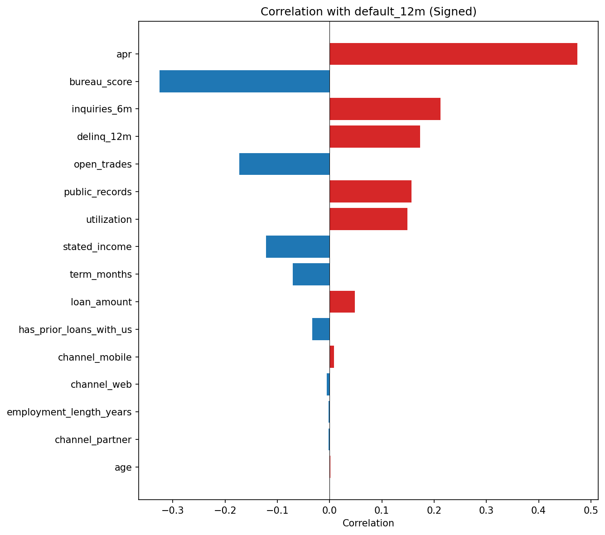

**Feature Correlation Heatmap**

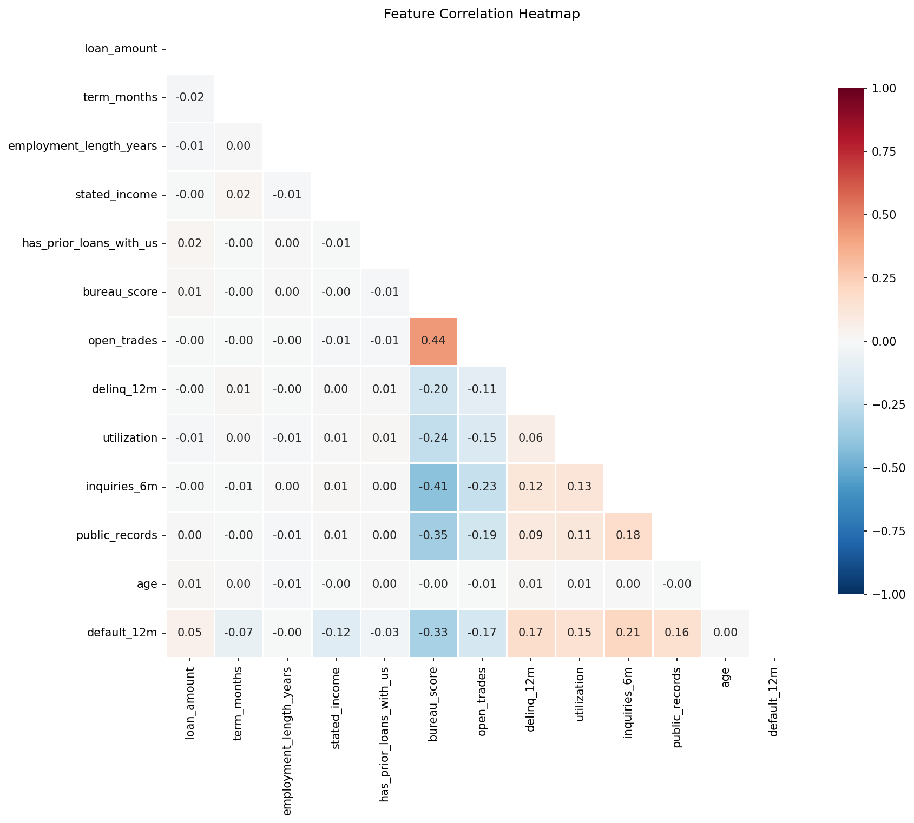

**Feature Distributions (Violin Plots)**

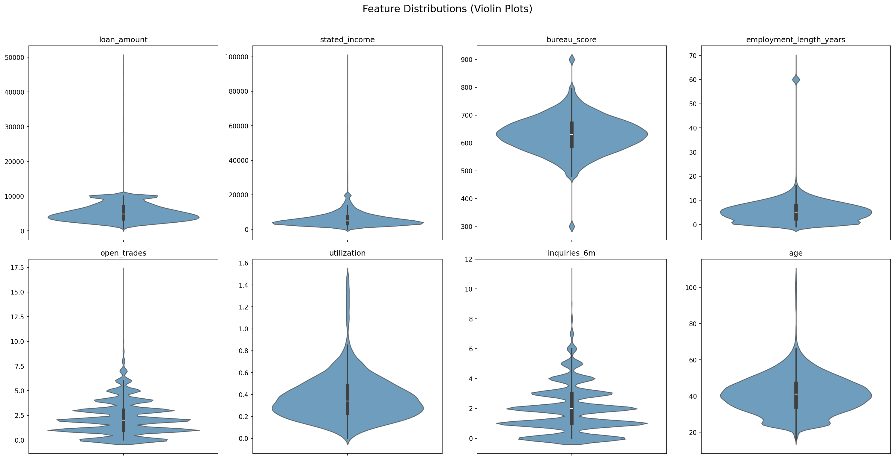

**Lift Plots: Continuous Features**

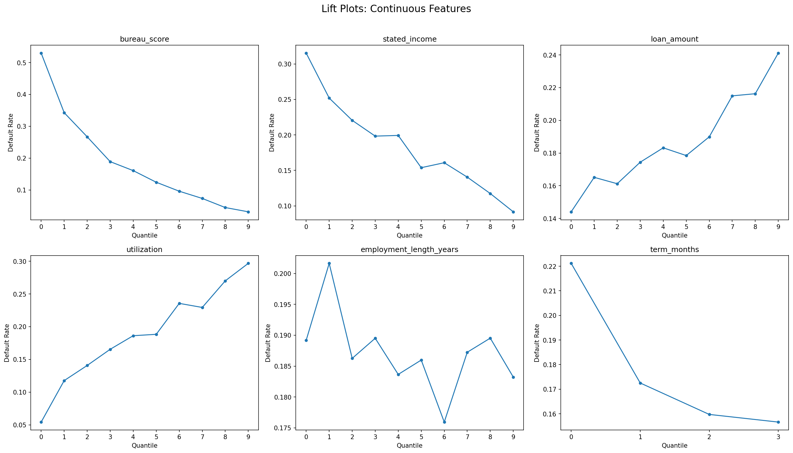

**Lift Plots: Discrete and Binary Features**

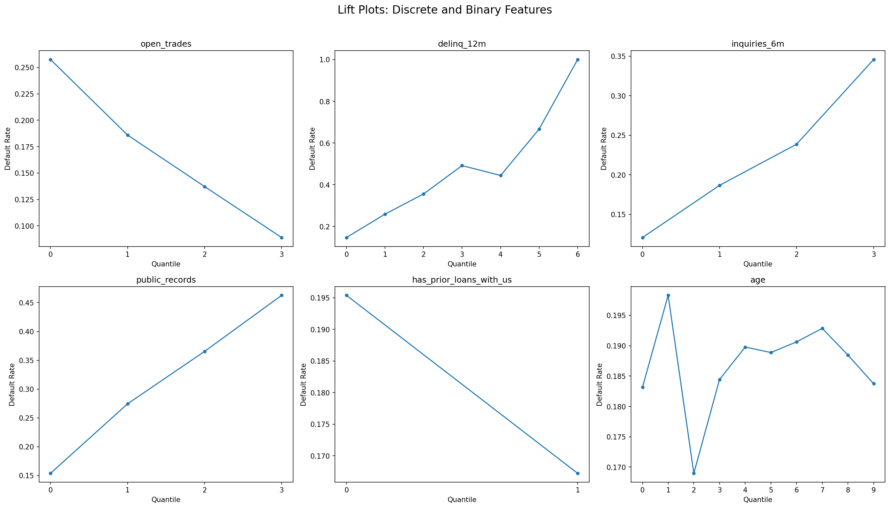

### 2. Data Splitting

An **out-of-time split** was used to reflect real deployment conditions. Loans were sorted chronologically and assigned:

| Split | Proportion | Default Rate |
|---|---|---|
| Train | 50% | 19.0% |
| Validation | 25% | 18.7% |
| Test | 25% | 18.1% |

Stable default rates across splits confirm minimal time-based drift.

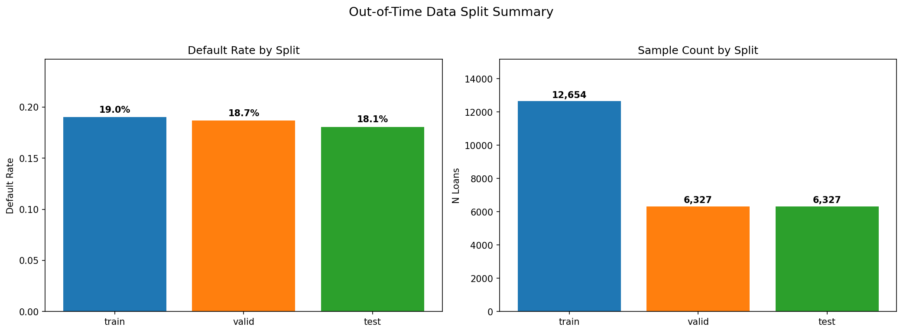

### 3. Preprocessing Pipeline

All preprocessing is **fit on training data only** and serialized via `joblib` for reproducible inference:

| Step | Description |
|---|---|
| **Generic Cleaning** | Handle term=0, normalize channel casing |
| **Pessimistic Imputation** | Missing risk factors imputed to `max` (worst case); protective factors to `min` |
| **Feature Engineering** | Log-transformed income, loan-to-income ratio, one-hot encoded channels |
| **Winsorization** | Clip at 1st/99th percentiles (logistic regression only) |
| **Standardization** | Z-score scaling (logistic regression only) |

**Excluded variables** (for compliance and defendability):
- Post-origination fields (`charged_off_amount`, `paid_interest_amount`, `apr`)
- State (sparse, hard to defend, overfitting risk)
- Age/DOB (fair lending compliance)

### 4. XGBoost Model

The XGBoost model captures nonlinear relationships and feature interactions:

- **Hyperparameter tuning**: Bayesian optimization via Optuna (50 trials per feature set), searching over learning rate, max depth, min child weight, gamma, subsample, colsample, L1/L2 regularization
- **Class imbalance**: Handled via `scale_pos_weight` (~4.26)
- **Monotone constraints**: Enforced to align model behavior with credit intuition
- **Dynamic feature elimination**: After each Optuna tuning round, the feature with the lowest XGBoost gain importance is removed and the model is re-tuned from scratch, continuing until 2 features remain
- **Isotonic calibration**: Applied on validation set for well-calibrated probabilities
- **Interpretability**: SHAP beeswarm plots confirm bureau score, loan-to-income, utilization, delinquencies, income, and inquiries as primary drivers
- **Fairness**: Disparate impact analysis by age group

**SHAP Feature Importance**

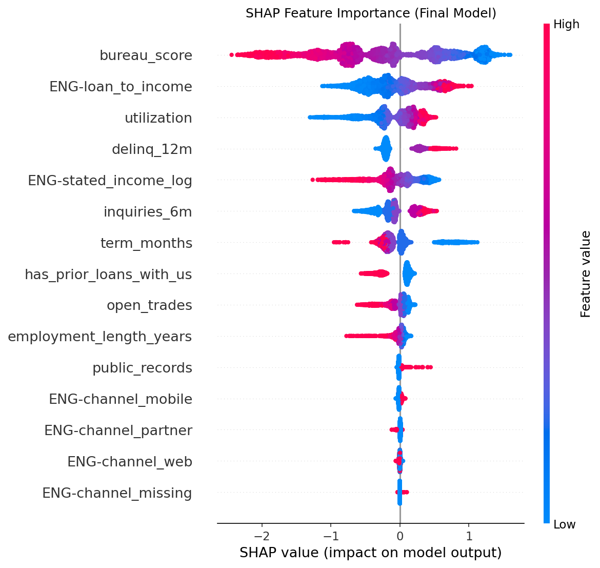

**ROC, Precision-Recall, and Calibration Curves**

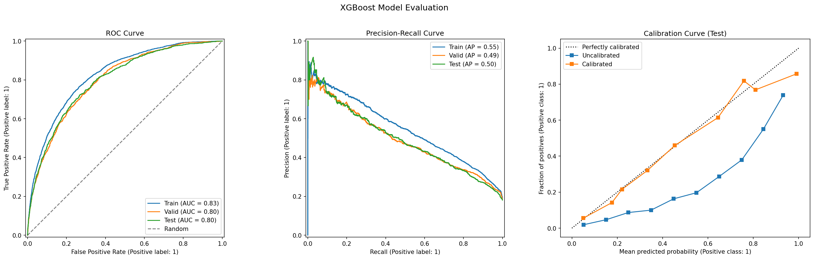

### 5. Logistic Regression Baseline

A logistic regression model serves as an interpretable baseline:

- **Multicollinearity check**: VIF values 1.0--1.8 (minimal collinearity)
- **Standardized features**: Z-score scaling for comparable coefficient magnitudes
- **Feature reduction**: Coefficient-based reverse stepwise removal to ~11 core features
- **Isotonic calibration**: Applied on validation set
- **Coefficient alignment**: All signs consistent with credit risk intuition
- **Disparate impact analysis**: Score distributions compared across age groups

**Signed Coefficients (Final Model)**

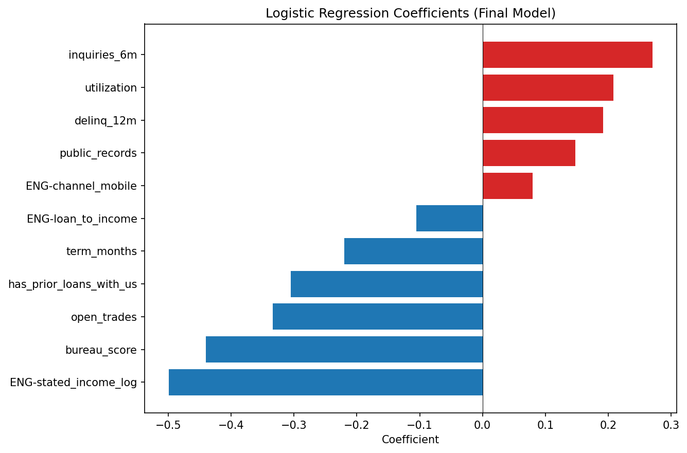

**ROC, Precision-Recall, and Calibration Curves**

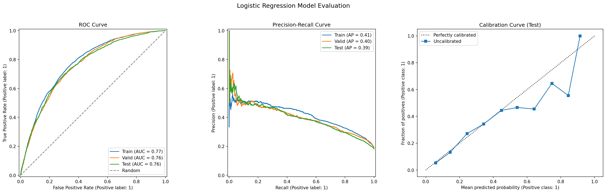

### 6. Model Comparison

| Metric | XGBoost | Logistic Regression | Relative Lift |
|---|---|---|---|
| ROC AUC (Valid) | 0.800 | 0.760 | +5.3% |
| ROC AUC (Test) | 0.800 | 0.758 | +5.5% |
| PR AUC (Valid) | 0.493 | 0.397 | +24.1% |
| PR AUC (Test) | 0.496 | 0.395 | +25.6% |

**Metrics Comparison**

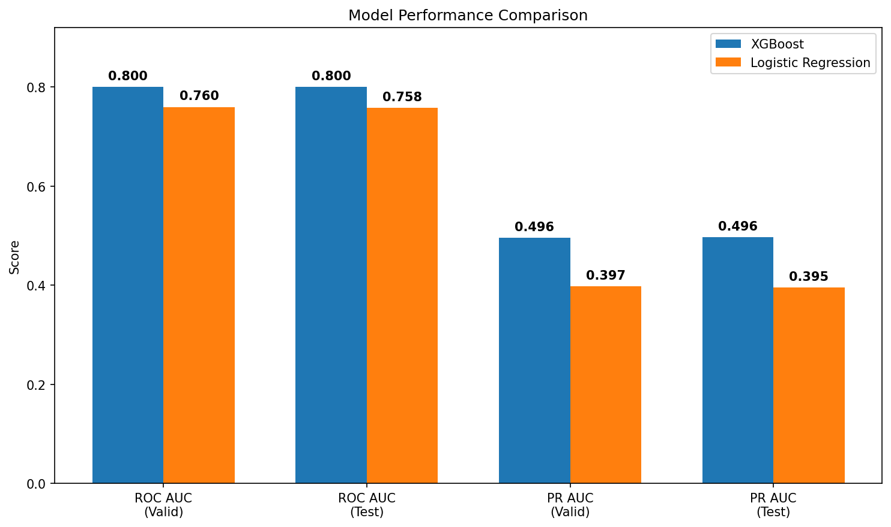

**ROC, PR, and Calibration Curves (Head-to-Head)**

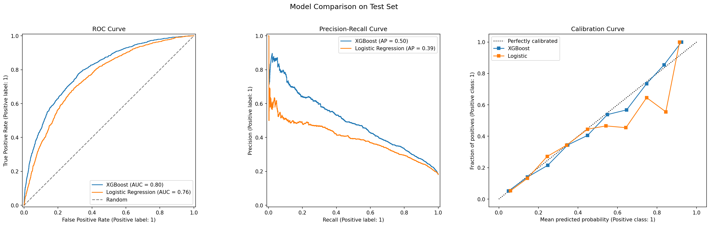

---

## Results

**XGBoost is the champion model.** Key findings:

- **5--6% relative ROC AUC lift** over logistic regression on held-out data
- **24--26% relative PR AUC lift**, meaning substantially better precision-recall tradeoff for identifying defaults
- **Consistent generalization** from validation to test, suggesting robust out-of-sample performance
- **11 final features** -- parsimonious yet powerful
- **Isotonic calibration** ensures predicted probabilities are well-calibrated for downstream decisioning

### Recommended Deployment Strategy

| Risk Tier | Action |
|---|---|
| **Low Risk** | Auto-approve |
| **Mid Risk** | Risk-based pricing or exposure limits |
| **High Risk** | Decline |

### Ongoing Governance

- Monitor for performance stability and data drift
- Track score distribution shifts over time
- Assess fair lending impact on protected classes
- Periodically retrain on fresh origination data

---

## Key Design Decisions

| Decision | Rationale |
|---|---|
| Out-of-time split (not random) | Mimics production deployment; detects temporal drift |
| Pessimistic imputation | Missing data treated conservatively -- assumes worst case for risk factors |
| Monotone constraints (XGBoost) | Ensures model respects known credit risk relationships |
| Excluded age, state, post-origination vars | Compliance, defendability, and data leakage prevention |
| SHAP for feature selection | Model-specific importance; more reliable than permutation for correlated features |
| Isotonic calibration on validation set | Produces well-calibrated probabilities without test set leakage |
| Serialized preprocessing pipeline | Guarantees identical transformations at inference time |
| Optuna Bayesian optimization | More efficient than grid search; explores a richer hyperparameter space with fewer evaluations |
| Gain-based dynamic feature elimination | Features removed based on what the model actually learned each round, not a pre-computed static ordering |

---

## Getting Started

### Prerequisites

- Python 3.10+
- AWS credentials configured (for S3 data access)

### Installation

```bash
pip install -r requirements.txt
```

### Running the Pipeline

Execute the notebooks in order:

```
01_eda/notebook.ipynb                  # Explore the data
02_split_data/notebook.ipynb           # Create train/valid/test splits
03_xgboost/notebook.ipynb              # Train and tune XGBoost model
04_logistic_regression/notebook.ipynb  # Train logistic regression baseline
05_comparison/notebook.ipynb           # Compare model performance
```

Each notebook is self-contained with its own preprocessing, modeling, and evaluation logic. All plots are saved to each notebook's `output/` directory. Serialized model artifacts (preprocessing pipeline, inference model, calibrated model) are also saved there for production use.
